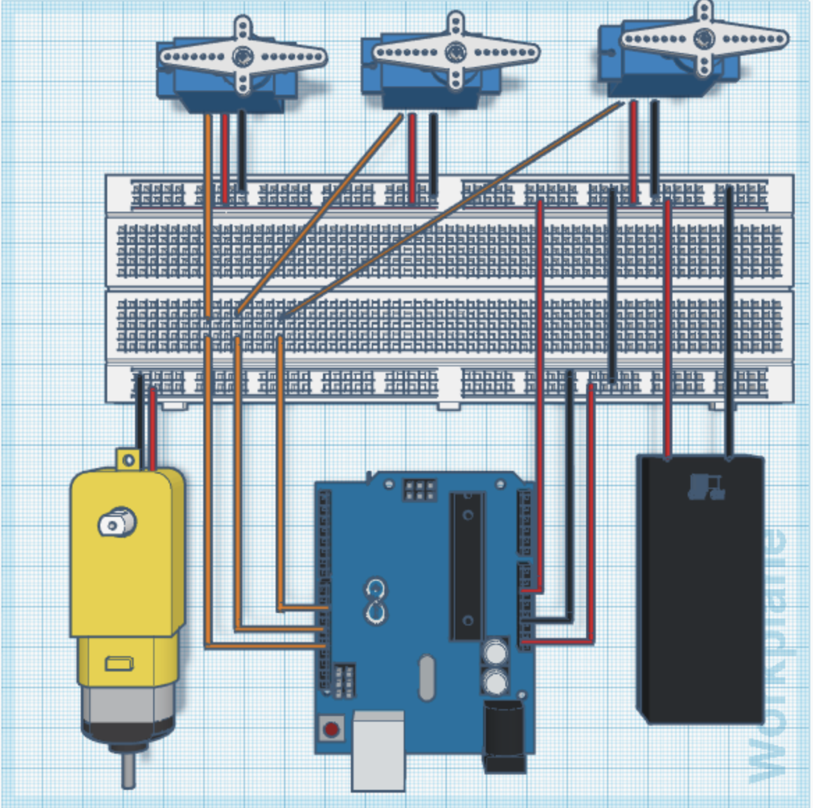
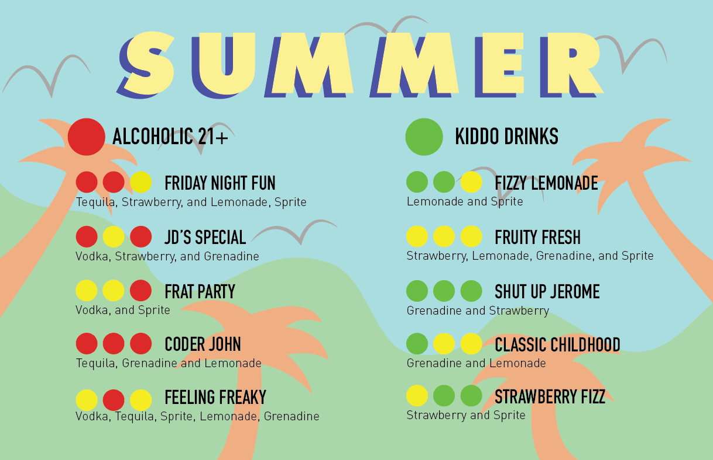
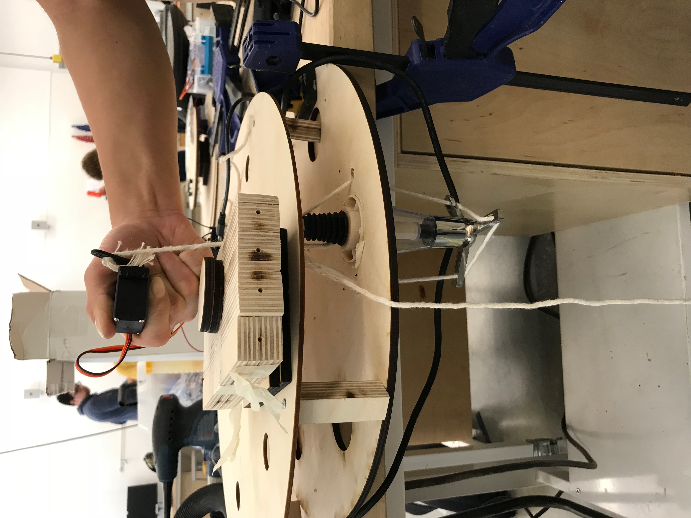

NB: You might find useful the [sample proposal](http://github.com/zamfi/ucb-jacobs-creative-programming-electronics-spring-2018/blob/master/hw/sample-proposal.md) useful in completing this assignment!

# Arduino Drink Mixer

Our project is an automatic drink mixer that can be operated with the press of 3 buttons.

## Team

John Sha, Jerome Wang, Natya Admira Dharmosetio, Cole Triebold

## Summary

We set out to create the finest drink mixer ever seen in Des Inv 23. Our goal was to create fine mixed drinks using simple arduino components. We created a menu of ten drinks which the user can choose by pressing 3 buttons in different sequences. After the input is placed, our mixer rotates a cup using a lazy-susan system. Once it reaches the first position, the parasaltic pump is activated and begins to dispense liquid. After dispensing the first liquid, the cup will return back to its starting position and then begin rotating to its next position. This process is repeated for each ingredient of the drink until it is properly mixed. Each pre-set drink has a measured amount of each ingredient added. 

## Component Parts

- 6 Parasaltic Pumps
- 4 1/4 inch wood sheets
- 20 ft of 4mm tubing
- Buttons
- Arduino/breadboard/wires
- Lazy Susan Ball Bearing
- DC motor
- 3D printed gear
- 6 Bottles of beverages for mixing

Inputs: 3 Button interface to input what beverage or beverage mixture is desired and how much to dispense (proportion of each liquid and total liquid volume). These will be routed through the Arduino board.

Outputs: Different nozzles pouring different types of liquids into the cup to create the perfect beverage. We will need to optimize the mix levels to create the best drinks for a given volume.

### Block Diagram

## Challenges

The largest challenge we encountered was choosing how to dispense the liquids from the bottles into the cup. We first bought a cheap parasaltic pump and air valve from Amazon to test before committing to a dispensing method. After finding out that the parasaltic pumps were seemingly too slow for what we wanted (50 mL in a minute when supplied with 12V). We then decided to take a different approach and shifted from using a pump/motor to a liquid dispenser (which dispenses an exact mount of liquid when pushed up). However, this dispenser required quite a bit of force to actuate (the servos we had were rated to 11kg of torque and wasn't strong enough!). Coding the Arduino was also a bit of a challenge as we had to learn functions and use a library that none of us were familiar with. There was a lot of trial and error in calibrating the amount of liquid dispensed (time dependent) as well as getting the cup into the right position. If we were to do this again, we would like to use a faster method of pumping the liquid whether it be through a faster parasaltic pump or a bartending-liquid-dispenser coupled with a stronger servo. 

## Timeline

- Week 1: Write proposal
- Week 2: Obtain all components, test methods of liquid dispensing, begin constructing the wood assembly
- Week 3: Continue building assembly and work out pumping issues
- Week 4: Work on electronics and hook up components
- Week 5: Present!

## Completed Work

### Final Prototype

### Hardware/Internals

### Drink Menu

## References and links

### Project Description

### Arduino Control Code

### Button-Code Reference

### Servo Testing (with push-dispenser)

Tutorials, comments, videos, magazine articles - anything you found that helps you understand your project.
